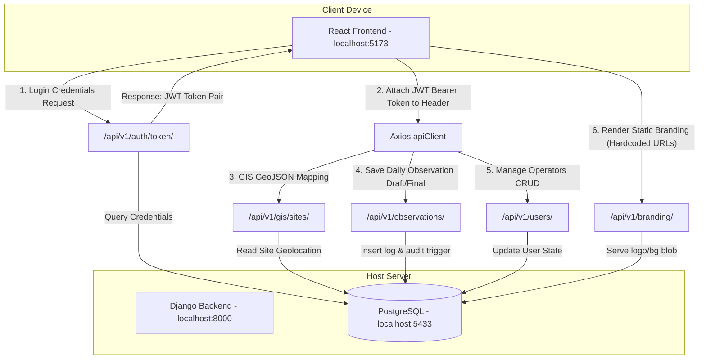

# BBMC Dam Monitoring System - Development Environment & Networking Report

This document contains the complete and verified local configurations, ports, directory structures, and environment settings of the **BBMC Dam Water Level Monitoring System** as extracted from the active codebase. 

Use this report to configure your local network testing, mobile emulators, firewalls, and Cloudflare tunnels.

---

## 1. Frontend Details

* **Frontend Framework Name**: React (v19.2.6) + TypeScript (v6.0.2) + Vite (v8.0.12)
* **Frontend Localhost URL**: `http://localhost:5173`
* **Frontend Port Number**: `5173`
* **Frontend Start Command**: `npm run dev` (Mapped to `vite` in `package.json`)
* **Frontend Environment Variables** (configured in `frontend/.env`):
  ```env
  VITE_API_BASE_URL=http://localhost:8000/api/v1
  ```
* **API Base URL Currently Used**: `http://localhost:8000/api/v1`
  * Defined in `frontend/src/api/client.ts` as:
    ```typescript
    const BASE_URL = import.meta.env.VITE_API_BASE_URL || 'http://localhost:8000/api/v1'
    ```
* **Vite or CRA**: **Vite** (uses `@vitejs/plugin-react` and `@tailwindcss/vite`).
* **Frontend Folder Structure**:
  ```text
  frontend/
  ├── .env                   # Local environment variables (API URLs)
  ├── .gitignore
  ├── eslint.config.js
  ├── index.html             # HTML entry point
  ├── package.json           # Dependencies, scripts, and build tasks
  ├── tsconfig.json          # TypeScript base configuration
  ├── vite.config.ts         # Vite bundler options
  ├── public/                # Static public assets (leaflet icons, browser icons)
  └── src/                   # Main React TypeScript source code
      ├── main.tsx           # Application bootstrap entry point
      ├── App.tsx            # Main routes container
      ├── index.css          # Global Tailwind styles
      ├── App.css            # Component-level styling overrides
      ├── api/               # Axios client configurations and interceptors
      │   └── client.ts      # Axios client with JWT refresh and retry logic
      ├── components/        # Reusable shared UI components
      ├── features/          # Domain-specific feature modules
      ├── gis/               # Leaflet map modules, layers, and coordinate trackers
      ├── hooks/             # Custom React Hooks
      ├── layouts/           # Page wrapper layouts (e.g., AuthLayout.tsx)
      ├── pages/             # Page view containers (e.g., Login.tsx)
      ├── routes/            # React Router configurations
      ├── store/             # Zustand state management (e.g., auth.store.ts)
      ├── types/             # Global TypeScript type definitions
      └── utils/             # Helper utilities (formatters, mathematical helpers)
  ```

---

## 2. Backend Details

* **Backend Framework/Version**: Django v5.0 + Django REST Framework (DRF)
* **Django Localhost URL**: `http://127.0.0.1:8000` (or `http://localhost:8000`)
* **Backend Port Number**: `8000`
* **Backend Run Command**: `python manage.py runserver` (bound to `127.0.0.1:8000` by default)
* **Current Allowed Hosts Configuration** (`backend/bbmc_backend/settings.py`):
  ```python
  ALLOWED_HOSTS = []
  ```
* **CORS Configuration** (`backend/bbmc_backend/settings.py`):
  ```python
  CORS_ALLOW_ALL_ORIGINS = True  # Allows all origins using django-cors-headers middleware
  ```
* **API Routes Being Used**:
  * **System Health Check**: 
    * `GET /api/v1/health/`
  * **Authentication & JWT Session (SimpleJWT & accounts)**:
    * `POST /api/v1/auth/token/` (Obtains access + refresh tokens)
    * `POST /api/v1/auth/token/refresh/` (Refreshes access token)
    * `POST /api/v1/auth/login/` (Session login)
    * `POST /api/v1/auth/logout/` (Session logout)
  * **Branding Management**:
    * `GET /api/v1/auth/branding/<str:image_type>/` (Fetches dynamic logo/background assets)
  * **User Management CRUD (Admin Only)**:
    * `GET/POST /api/v1/users/` (List all users / Create new operator)
    * `GET/PUT/PATCH/DELETE /api/v1/users/<int:user_id>/` (Manage individual user details)
    * `POST /api/v1/users/<int:user_id>/reset-password/` (Reset credentials)
    * `POST /api/v1/users/<int:user_id>/status/` (Toggle user status active/inactive)
  * **Site Master Management (Dam Sites)**:
    * `GET/POST /api/v1/sites/` (List all dam stations / Add a new station)
    * `GET/PUT/PATCH/DELETE /api/v1/sites/<int:site_id>/` (Manage individual dam metadata)
    * `POST /api/v1/sites/<int:site_id>/toggle/` (Toggle site operational status)
  * **Observations Data Entry**:
    * `GET/POST /api/v1/observations/` (CRUD for water logs via DRF DefaultRouter)
    * `GET/POST /api/v1/observations-details/` (CRUD for structural logs via DefaultRouter)
  * **Audit Log Trail**:
    * `GET /api/v1/audit/` (List audit log records via DefaultRouter)
  * **GIS Geographic Interface**:
    * `GET /api/v1/gis/sites/` (GeoJSON list of all sites with lat, lng, and status)
* **JWT/Auth Configuration** (`backend/bbmc_backend/settings.py`):
  * Custom User Model: `accounts.User`
  * DRF Authentication Classes: SimpleJWT's `JWTAuthentication` and `SessionAuthentication`.
  * SimpleJWT Parameters:
    ```python
    SIMPLE_JWT = {
        'ACCESS_TOKEN_LIFETIME': timedelta(hours=8),
        'REFRESH_TOKEN_LIFETIME': timedelta(days=7),
        'ROTATE_REFRESH_TOKENS': False,
        'BLACKLIST_AFTER_ROTATION': False,
        'AUTH_HEADER_TYPES': ('Bearer',),
        'USER_ID_FIELD': 'user_id',
    }
    ```
* **Backend Environment Variables**: None currently used. All properties (Secret Key, Database credentials, JWT variables) are currently hardcoded directly in `backend/bbmc_backend/settings.py`.

---

## 3. PostgreSQL Database Details

* **PostgreSQL Host**: `127.0.0.1` (localhost loopback)
* **Database Port**: `5433` (Warning: Uses custom port `5433` rather than standard `5432`)
* **Database Name**: `bbmc_dam_monitoring`
* **Database Connection Method**: Django standard DB engine `django.db.backends.postgresql` (using `psycopg2` driver).
* **pgAdmin Configuration**:
  * **Host**: `127.0.0.1`
  * **Port**: `5433`
  * **Username**: `bbmc_user`
  * **Password**: `StrongPass@2024`
  * **Database Name**: `bbmc_dam_monitoring`
* **Django Database Settings** (`backend/bbmc_backend/settings.py`):
  ```python
  DATABASES = {
      'default': {
          'ENGINE': 'django.db.backends.postgresql',
          'NAME': 'bbmc_dam_monitoring',
          'USER': 'bbmc_user',
          'PASSWORD': 'StrongPass@2024',
          'HOST': '127.0.0.1',
          'PORT': '5433',
          'CONN_MAX_AGE': 600,
      }
  }
  ```
* **Local or Remote DB**: **Local Database** (running locally on custom port `5433`).

---

## 4. Current Active Ports

* **Frontend Dev Server** (Vite) → `localhost:5173`
* **Backend Server** (Django) → `localhost:8000`
* **Database Server** (PostgreSQL) → `localhost:5433` (deliberate non-standard port to avoid conflicts with default PostgreSQL `5432` engines)

### Port Conflicts/Blocked Check:
* There are no active conflicts between frontend and backend.
* Check if there are other web services running on standard `8000` or `5173` ports before running. If port `5433` is blocked, PostgreSQL will fail to bind, preventing Django from launching (handled in `LAUNCH_BBMC.bat` which asserts DB connection readiness before boot).

---

## 5. API Connectivity Mapping



### Complete Flow Details:
1. **User Authentication Flow**:
   * Frontend Form (`/login`) sends credentials via Axios POST request to `http://localhost:8000/api/v1/auth/token/`.
   * Django verifies the hash against `accounts.User` in the database on port `5433`.
   * Backend returns access (valid 8h) and refresh (valid 7d) tokens.
   * Axios request interceptor (`frontend/src/api/client.ts`) attaches `Authorization: Bearer <access_token>` to all subsequent requests.
   * If token expires, Axios response interceptor calls `/api/v1/auth/token/refresh/` automatically.
2. **GIS Mapping Flow**:
   * Leaflet Map Component in React calls `GET http://localhost:8000/api/v1/gis/sites/`.
   * GIS view pulls active stations with longitude and latitude variables.
   * Renders them dynamically as markers with live water level colors.
3. **Data Entry Flow**:
   * Operators complete a form and hit "Submit".
   * POST request maps to `http://localhost:8000/api/v1/observations/`.
   * Observation details are saved to database; Django automatically hooks an entry into the `AuditLog` table using the `audit` app to log the timestamp and actor.

---

## 6. Environment Files & Hardcoded Pitfalls

An audit of environment settings revealed several hardcoded references that **will block remote network access or mobile testing** if left unconfigured:

### 1. Hardcoded Localhost Variables in Presentation Layouts (CRITICAL FAILURE POINT)
* **`frontend/src/pages/Login.tsx` (Line 35)**:
  ```tsx
  src="http://localhost:8000/api/v1/branding/logo/"
  ```
* **`frontend/src/layouts/AuthLayout.tsx` (Line 8)**:
  ```tsx
  backgroundImage: 'url("http://localhost:8000/api/v1/branding/background/")'
  ```
  > [!WARNING]
  > **Why this will break remote/mobile access**: When testing on a mobile device or via a tunnel, the remote device's browser will try to resolve `http://localhost:8000` (its own loopback address) rather than the server's network address, causing the logo and background images to load as blank placeholders.

### 2. Hardcoded Port Settings & Defaults
* **Vite API fallback in `frontend/src/api/client.ts`**: Fallback defaults to `http://localhost:8000/api/v1` if environment variables are missing.
* **Database in `backend/bbmc_backend/settings.py`**: Hardcoded to `127.0.0.1` and port `5433`. This restricts database connectivity strictly to the local host machine (safe, but restricts remote DB monitoring engines).

---

## 7. Network & Mobile Testing Readiness

* **Can frontend run on `0.0.0.0`?**
  * **Current Status**: **NO**.
  * **Solution**: Vite binds to `127.0.0.1` by default. To make it listen to the host's IP on the local network (for testing on real phones in the same Wi-Fi), run Vite with the host argument:
    ```bash
    npm run dev -- --host 0.0.0.0
    ```
* **Can Django run on `0.0.0.0`?**
  * **Current Status**: **NO**.
  * **Solution**: Change the start command to bind to all interfaces:
    ```bash
    python manage.py runserver 0.0.0.0:8000
    ```
* **Firewall Restrictions**:
  * Windows Firewall blocks incoming connections on ports `5173` and `8000` by default. You will need to allow `Node.js JavaScript Runtime` and `Python` in Windows Defender Firewall to allow local network devices to connect.
* **Localhost-Only Limitations**:
  * **Django Allowed Hosts restriction**: `ALLOWED_HOSTS = []` strictly blocks any request coming from an IP address that is not `localhost` or `127.0.0.1`. Attempting to access Django from a mobile phone using the host computer's IP (e.g. `http://192.168.1.50:8000`) will throw a `400 Bad Request` error.
  * **Logo & Background URLs**: Hardcoded to `http://localhost:8000` in React code.
* **CORS Issues**:
  * None expected because `CORS_ALLOW_ALL_ORIGINS = True` is active.
* **Mixed-Content Limitations**:
  * Secure tunnels (HTTPS) calling an insecure API (HTTP localhost) will be blocked on modern Android and iOS devices because mobile browsers block mixed-content requests by default. Tunnels must expose **both** services on HTTPS.

---

## 8. Cloudflare Tunnel Readiness

To successfully bridge the local development server into a secure HTTPS remote URL for mobile testing, follow these precise configuration steps:

### 1. Tunnel Architecture
* **Frontend Service**: Binds to `http://localhost:5173`
* **Backend Service**: Binds to `http://localhost:8000`

### 2. Django Settings Updates (Mandatory)
Before starting, update `backend/bbmc_backend/settings.py` to permit Cloudflare request headers:
```python
# settings.py
ALLOWED_HOSTS = ['localhost', '127.0.0.1', '.trycloudflare.com']
```

### 3. Fixing Hardcoded Presentation Assets (Mandatory)
Modify `Login.tsx` and `AuthLayout.tsx` to read the logo and background images using the configured API client base URL rather than hardcoded `localhost:8000` strings:
* **In `Login.tsx`**: Resolve the source dynamically:
  ```typescript
  const API_URL = import.meta.env.VITE_API_BASE_URL || 'http://localhost:8000/api/v1';
  // Use in JSX: src={`${API_URL}/branding/logo/`}
  ```
* **In `AuthLayout.tsx`**:
  ```typescript
  const API_URL = import.meta.env.VITE_API_BASE_URL || 'http://localhost:8000/api/v1';
  // Use in styles: backgroundImage: `url("${API_URL}/branding/background/")`
  ```

### 4. Cloudflared Execution Commands
Execute these commands in two separate terminal instances to spawn secure, ephemeral tunnels:

* **Spawning Frontend Tunnel**:
  ```powershell
  cloudflared tunnel --url http://localhost:5173
  ```
  *(Record the generated URL, e.g., `https://bbmc-frontend.trycloudflare.com`)*

* **Spawning Backend Tunnel**:
  ```powershell
  cloudflared tunnel --url http://localhost:8000
  ```
  *(Record the generated URL, e.g., `https://bbmc-api.trycloudflare.com`)*

### 5. Frontend Environment Update
Once the backend tunnel is active, update `frontend/.env` to route requests correctly:
```env
VITE_API_BASE_URL=https://bbmc-api.trycloudflare.com/api/v1
```
Rebuild/restart your Vite server so that it binds requests to the tunnel instead of local loopbacks.

---

## 9. Security Audit & Risky Configurations

1. **`DEBUG = True` is active**:
   * **Risk**: Stack traces, environment variables, database structure, and queries are exposed to users in the event of an API crash. High risk.
2. **Hardcoded Sensitive Secrets**:
   * `SECRET_KEY = 'django-insecure-z^$@!*&^%$#@!*&^%$#@!*&^%$#@!*&^%$#@!*&^%$#@!'` is committed in plaintext.
   * `DATABASES.default.PASSWORD = 'StrongPass@2024'` is exposed in settings.
3. **Weak CORS Configuration**:
   * `CORS_ALLOW_ALL_ORIGINS = True` enables requests from any host. While useful for testing, this should be restricted to the specific frontend origin in staging/production.
4. **No HTTPS/SSL Enforcement**:
   * `SECURE_SSL_REDIRECT = False` (implicit default). No secure cookie protections (`SESSION_COOKIE_SECURE`, `CSRF_COOKIE_SECURE`) are enabled.

---

## 10. Summary Matrix for Quick Reference

| Configuration Param | Current Value | remote / mobile test ready | Action Required |
| :--- | :--- | :---: | :--- |
| **Frontend dev url** | `http://localhost:5173` | ⚠️ | Start with `npm run dev -- --host 0.0.0.0` |
| **Backend dev url** | `http://localhost:8000` | ⚠️ | Start with `python manage.py runserver 0.0.0.0:8000` |
| **Database Port** | `5433` (PostgreSQL) | ✅ | No changes needed (custom port works locally) |
| **Django Allowed Hosts**| `[]` | ❌ | Add `'.trycloudflare.com'` or host local IP |
| **Hardcoded Assets** | `http://localhost:8000/api/...` | ❌ | Replace with dynamic base url variable |
| **Environment Files** | `frontend/.env` only | ⚠️ | Update `VITE_API_BASE_URL` with tunnel URL |
| **Admin Login User** | `admin_master` | ✅ | Ready (Admin Login Credentials) |
| **Admin Login Pass** | `DamAdmin@2026` | ✅ | Ready (Admin Login Credentials) |
